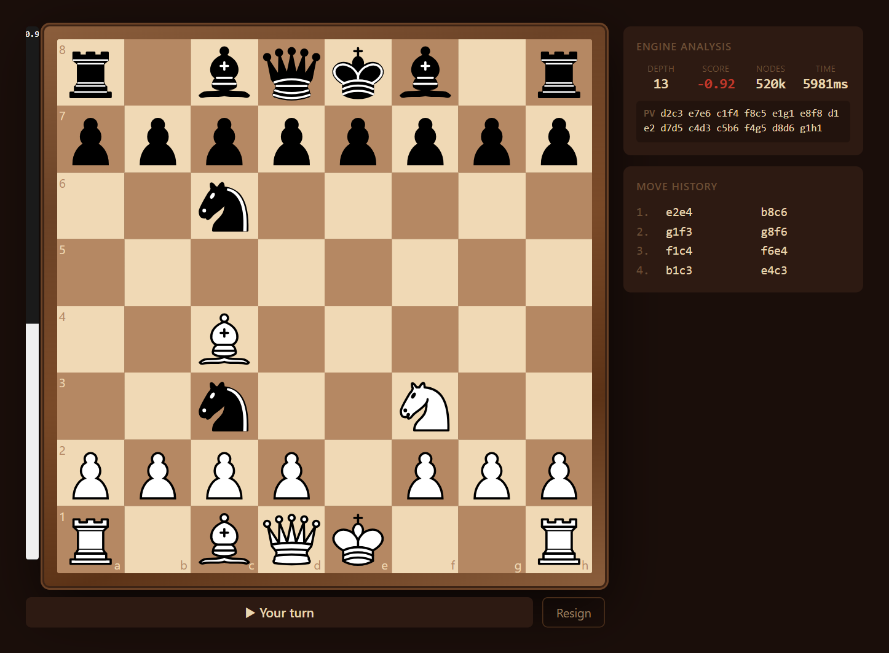

# Chess Engine

A full-stack chess application built around a chess engine written from scratch in C#. The engine uses magic bitboards and an alpha-beta search. An ASP.NET Core API serves it over REST and SignalR, and a React + TypeScript frontend lets you play against it and watch its analysis live.



## Highlights

- **Engine written from scratch.** No Stockfish and no third-party chess library on the backend.
- **Magic bitboards** for fast sliding-piece attack generation, plus incremental Zobrist hashing.
- **Search:** iterative deepening, principal variation search, aspiration windows, null-move pruning, late move reductions, futility pruning, mate-distance pruning, quiescence search, and repetition detection.
- **Move ordering:** transposition table move, then MVV-LVA captures, then killer moves, then the history heuristic.
- **Tapered evaluation** that blends middlegame and endgame scores for material, piece-square tables, pawn structure, mobility, king safety, rook placement and the bishop pair.
- **Transposition table** with 2²³ (~8.4M) entries.
- **Live analysis:** SignalR streams depth, score, node count and principal variation to the UI while the engine searches.
- **Perft-verified move generation**, tested against known node counts.

## Architecture

```
.
├── Chess.Engine.Core/   Board representation, bitboards, move generation, Zobrist hashing
├── Chess.Engine.AI/     Search, evaluation, transposition table
├── Chess.API/           ASP.NET Core Web API + SignalR hub
├── Chess.Tests/         xUnit tests (perft, board, search, evaluation, TT)
├── chess-ui/            React 19 + TypeScript + Vite frontend
└── docs/                Architecture overview (PDF/PPTX) and pseudocode
```

`Chess.Engine.Core` has no dependencies. `Chess.Engine.AI` depends only on Core. The API is a thin layer over both.

## Tech Stack

| Layer       | Technology                                   |
|-------------|----------------------------------------------|
| Engine      | C# 14 / .NET 10                              |
| API         | ASP.NET Core 10, SignalR, OpenAPI + Scalar    |
| Frontend    | React 19, TypeScript, Vite                   |
| Board UI    | react-chessboard, chess.js                   |
| Tests       | xUnit                                        |

## Getting Started

### Prerequisites

- [.NET 10 SDK](https://dotnet.microsoft.com/download)
- [Node.js 20+](https://nodejs.org/)

### 1. Run the API

From the repository root:

```bash
dotnet run --project Chess.API
```

The API listens on `http://localhost:5241`. In the Development environment, interactive API docs (Scalar) are at <http://localhost:5241/scalar> and the raw OpenAPI document is at `/openapi/v1.json`.

### 2. Run the frontend

```bash
cd chess-ui
npm install
npm run dev
```

Open <http://localhost:5173>. The Vite dev server proxies `/api` and `/hubs` to the API on port 5241, so no extra configuration is needed.

### 3. Run the tests

```bash
dotnet test
```

## API Reference

### Game

| Method | Route                   | Description                                        |
|--------|-------------------------|----------------------------------------------------|
| POST   | `/api/game/start`       | Start a game. Body: `{ "playerColor": "white" \| "black" }` |
| POST   | `/api/game/move`        | Play a UCI move and get the engine's reply. Body: `{ "gameId", "move" }` |
| GET    | `/api/game/{id}/state`  | Current FEN, move list and status                  |
| POST   | `/api/game/{id}/resign` | Resign the game                                    |

### Engine

| Method | Route                       | Description                                             |
|--------|-----------------------------|---------------------------------------------------------|
| POST   | `/api/engine/move`          | Best move for a FEN. Body: `{ "fen", "depth", "timeMs" }` |
| POST   | `/api/engine/evaluate`      | Static evaluation of a FEN (centipawns)                 |
| GET    | `/api/engine/perft/{depth}` | Perft node count. Optional `?fen=` query parameter      |

Example requests are in [`Chess.API/Chess.API.http`](Chess.API/Chess.API.http).

### SignalR hub: `/hubs/engine`

| Direction       | Message                          | Payload                                 |
|-----------------|----------------------------------|-----------------------------------------|
| Client → Server | `FindBestMove(fen, depth, timeMs)` | Starts a search                        |
| Server → Client | `searchProgress`                 | `{ depth, score, nodes, timeMs, pv }` per iteration |
| Server → Client | `bestMove`                       | `{ move, score, depth, nodes, timeMs }` |
| Server → Client | `searchError`                    | Error message                           |

## Engine Design

### Board representation

- 12 piece bitboards plus occupancy bitboards for white, black and all pieces
- A mailbox array for O(1) piece lookup by square
- Castling rights, en passant square, move clocks and a Zobrist hash, all updated incrementally in make/unmake

### Move encoding

Each move is packed into a single 32-bit integer:

```
bits  0–5   from square
bits  6–11  to square
bits 12–15  flag (quiet, capture, double push, castle, en passant, promotions)
bits 16–19  captured piece
bits 20–23  promotion piece
```

### Move generation

Pseudo-legal moves come from precomputed magic bitboard attack tables. Each move is then made on the board and kept only if it doesn't leave the king in check. Correctness is checked by perft tests against standard positions.

### Search

```
Iterative deepening
  └─ Aspiration window (±50 cp), re-searched on fail
      └─ Negamax alpha-beta with PVS
           ├─ Mate distance pruning, 50-move and repetition draws
           ├─ Transposition table probe
           ├─ Null-move pruning (R = 3)
           ├─ Move ordering: TT move → MVV-LVA → killers → history
           ├─ Futility pruning (depth ≤ 2)
           ├─ Late move reductions (depth ≥ 3, move index ≥ 4)
           └─ Quiescence search at the leaves
```

### Evaluation

| Term              | Notes                                                    |
|-------------------|----------------------------------------------------------|
| Material          | P 100, N 320, B 330, R 500, Q 900                         |
| Piece-square tables | Separate middlegame and endgame tables, tapered by game phase |
| Pawn structure    | Penalties for isolated and doubled pawns, bonuses for passed pawns |
| Mobility          | Per-piece mobility bonuses                               |
| King safety       | Pawn shelter and exposure to attack |
| Rooks             | Bonuses for open and half-open files and for rooks on the 7th rank |
| Bishop pair       | Flat bonus                                               |

## Known Limitations

This is a learning and portfolio project that runs locally. It isn't hardened for production:

- Games are kept in memory and lost when the server restarts. There is no auth or persistence.
- One transposition table is shared by every search, so concurrent users can interfere with each other's searches.
- Game-over detection doesn't handle threefold repetition or most insufficient-material draws. The search itself does detect repetitions.
- CORS is fully open for local development.

## Documentation

`docs/` contains an architecture overview ([PDF](docs/Chess_API_Overview.pdf), [PPTX](docs/ChessEngineArchitecture.pptx)) and pseudocode for each layer.

## License

[MIT](LICENSE)
